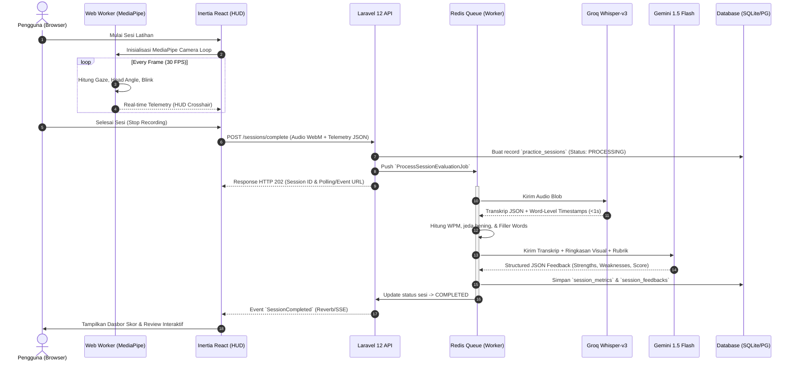

# System Architecture & Technical Specification — VOIC
**Hybrid On-Device & Cloud Intelligence Architecture**

---

## 1. High-Level Architectural Topology

Sistem **VOIC** dirancang menggunakan arsitektur **Hybrid Edge-Cloud**. Prinsip utamanya adalah: **beban komputasi visual berlatensi tinggi diselesaikan di sisi pengguna (Client-Side Edge)**, sementara **evaluasi semantik dan transkripsi berakurasi tinggi ditangani oleh micro-pipeline cloud berkecepatan tinggi**.

```
┌──────────────────────────────────────────────────────────────────────────────────────────────────┐
│                                       CLIENT ENVIRONMENT (EDGE)                                  │
│                                                                                                  │
│   Webcam Stream (30 FPS) ──> [ Web Worker: Google MediaPipe ] ──> Gaze Vector & Composure Log   │
│                               (Iris + Head Pose Estimation)       (Time-series JSON in memory)   │
│                                                                                                  │
│   Mic Stream (48kHz Mono) ─> [ MediaRecorder API (WebM/Opus) ] ──> Compressed Audio Blob         │
│                              [ Web Audio API Visualizer ]     ──> Canvas Hardware Waveform       │
└────────────────────────────────────────────────┬─────────────────────────────────────────────────┘
                                                 │
                                                 │ POST /api/sessions/evaluate
                                                 │ (Audio File + Telemetry JSON Payload)
                                                 ▼
┌──────────────────────────────────────────────────────────────────────────────────────────────────┐
│                                     BACKEND LAYER (LARAVEL 12)                                   │
│                                                                                                  │
│   [ Routing & Sanctum Auth ] ──> [ SessionEvaluationRequest ] ──> [ Temporary Storage Disk ]     │
│                                                                         │                        │
│                                                                         ▼                        │
│                                                             [ Redis Queue Dispatch ]             │
│                                                            (ProcessSessionEvaluationJob)         │
└────────────────────────────────────────────────┬────────────────────────┬────────────────────────┘
                                                 │                        │
                    ┌────────────────────────────┘                        └────────────────────────┐
                    ▼                                                                              ▼
┌──────────────────────────────────────┐                                    ┌──────────────────────────────────────┐
│        AUDIO STT CLOUD PIPELINE      │                                    │        SEMANTIC & RUBRIC PIPELINE    │
│                                      │                                    │                                      │
│   [ Groq Whisper-large-v3 API ]      │                                    │   [ Gemini 1.5 Flash / Claude API ]  │
│   - Ultra-fast transcription (<1s)   │                                    │   - Academic & Interview Rubrics     │
│   - Word-level timestamps            │                                    │   - Behavioral Action Items          │
│   - Raw transcript text              │                                    │   - Argument Structure Grading       │
└──────────────────┬───────────────────┘                                    └──────────────────┬───────────────────┘
                   │                                                                           │
                   ▼                                                                           ▼
┌──────────────────────────────────────────────────────────────────────────────────────────────────┐
│                             ALGORITHMIC METRIC SYNTHESIZER (LARAVEL)                             │
│                                                                                                  │
│   - Words Per Minute (WPM) Dynamic Curve      - Eye Contact % (Correlated with Timestamps)       │
│   - Localized Filler Word Count (ID & EN)     - Composite Nervousness Index                      │
│                                                                                                  │
│   ==> Persisted to: `practice_sessions`, `session_metrics`, `session_feedbacks`                  │
│   ==> Broadcasted to Client via: Laravel Reverb / SSE / Real-Time Inertia State                  │
└──────────────────────────────────────────────────────────────────────────────────────────────────┘
```

---

## 2. End-to-End Hybrid Processing Pipeline

### 2.1 Sequence Diagram



---

## 3. Detailed Component Breakdown

### 3.1 Client-Side On-Device Intelligence
* **MediaPipe Face Mesh via Web Worker:**
  * Komputasi deteksi landmark wajah (468 titik) dijalankan di *Web Worker* terpisah agar *main UI thread* peramban tetap responsif pada 60 FPS tanpa jank.
  * Menghitung Euclidean distance antara iris kiri/kanan terhadap sudut mata untuk menentukan *Normalized Gaze Vector*.
  * Menghitung rotasi Euler 3D (Pitch, Yaw, Roll) dari landmark hidung, dagu, dan dahi untuk mengukur kestabilan postur kepala.
  * Hasil disimpan dalam larik per detik:
    ```json
    {
      "second": 14,
      "eye_contact": true,
      "head_pose": { "pitch": 2.1, "yaw": -1.4, "roll": 0.5 },
      "blink": false
    }
    ```

* **Audio Capture & Canvas Waveform:**
  * Menggunakan `MediaRecorder` dengan codec `audio/webm;codecs=opus` pada *bitrate* 32 kbps.
  * Memanfaatkan `AudioContext` dan `AnalyserNode` untuk merender osiloskop digital perangkat keras nyata pada `<canvas>` (bukan simulasi CSS animasi generik).

### 3.2 Backend Service & Pipeline Architecture (Laravel 12)

* **Controller Layer:**
  * `PracticeSessionController@store`: Memvalidasi payload audio dan JSON telemetri menggunakan Laravel `FormRequest`.
  * Menghindari pemrosesan sinkron yang memblokir request. Seluruh proses analisis diarahkan ke antrean (*Redis Queue*).

* **Modular Domain Services:**
  1. `App\Services\Audio\GroqWhisperService`: Menghubungkan Laravel dengan Groq REST API (`/openai/v1/audio/transcriptions`), mengirim audio dengan model `whisper-large-v3`, mengembalikan transkrip dan timestamps.
  2. `App\Services\Analytics\SpeechMetricAnalyzer`: Menguraikan teks transkripsi ber-timestamp:
     * Menghitung WPM: `(Total Kata / Durasi Menit)`.
     * Regex scanning kamus *filler words* berbasis konteks bahasa.
     * Mengidentifikasi *long silent pauses* (>3 detik) dari gap timestamp kata.
  3. `App\Services\AI\LLMRubricEvaluator`: Mengompilasi *system prompt* berstandar akademik/HR, menyisipkan data transkripsi dan ringkasan metrik visual, lalu mengeksekusi panggilan ke Gemini 1.5 Flash / Claude 3.5 Sonnet dengan output terstruktur (*JSON schema mode*).

* **Storage Strategy:**
  * File audio disimpan di disk `local` atau `s3` (driver privat).
  * URL audio dienkripsi dengan *temporary signed URL* saat diputar kembali di dasbor review.

---

## 4. Security, Privacy & Boundary Protection

| Dimensi | Kebijakan Arsitektur VOIC |
| :--- | :--- |
| **Zero Video Storage** | Aliran video kamera diproses secara eksklusif di RAM peramban pengguna. Tidak ada frame gambar atau video yang ditransmisikan ke jaringan atau disimpan di server. |
| **Encrypted Audio-at-Rest** | Rekaman audio disimpan menggunakan AES-256 pada disk penyimpanan dan hanya dapat diakses oleh pemilik sesi yang terotentikasi. |
| **GDPR / Privacy Compliance** | Pengguna memiliki kontrol penuh (*one-click delete*) untuk menghapus sesi latihan, rekaman audio, dan data metrik secara instan dari database. |
| **API Rate Limiting** | Endpoint evaluasi AI diproteksi dengan rate limiter berbasis peran (*e.g., 10 evaluasi per jam per user*) untuk mencegah penyalahgunaan kuota API. |

---

## 5. Cost & Scalability Comparative Analysis

Model Hybrid VOIC menghasilkan efisiensi biaya yang masif jika dibandingkan dengan arsitektur konvensional yang memproses video di server (*Cloud Video AI*):

| Parameter | Arsitektur Tradisional (Server Video AI) | Arsitektur Hybrid VOIC (Edge + Groq + LLM) |
| :--- | :--- | :--- |
| **Beban Server & GPU** | Membutuhkan GPU Server (e.g., NVIDIA T4/A10G) untuk inferensi video | **$0 GPU Server** (Dijalankan di CPU/GPU peramban pengguna) |
| **Bandwidth Transfer** | ~150 MB per sesi 3 menit (HD Video) | **< 1.5 MB** per sesi 3 menit (Opus Audio + JSON) |
| **Biaya STT & Transkripsi** | ~$0.018 / menit (OpenAI Whisper Standard) | **$0.0018 / menit** (Groq Whisper-large-v3, 10x lebih murah & 5x lebih cepat) |
| **Biaya LLM Reasoning** | ~$0.02 (GPT-4) | **~$0.001** (Gemini 1.5 Flash via JSON Mode) |
| **Total Estimasi Biaya / Sesi** | **~$0.30 - $0.50 per sesi** | **~$0.003 - $0.005 per sesi (~100x Lebih Hemat)** |
| **Kapasitas Skalabilitas** | 100 concurrent user butuh cluster server raksasa | 10.000 concurrent user dapat dilayani oleh 1 instance Laravel standar |
