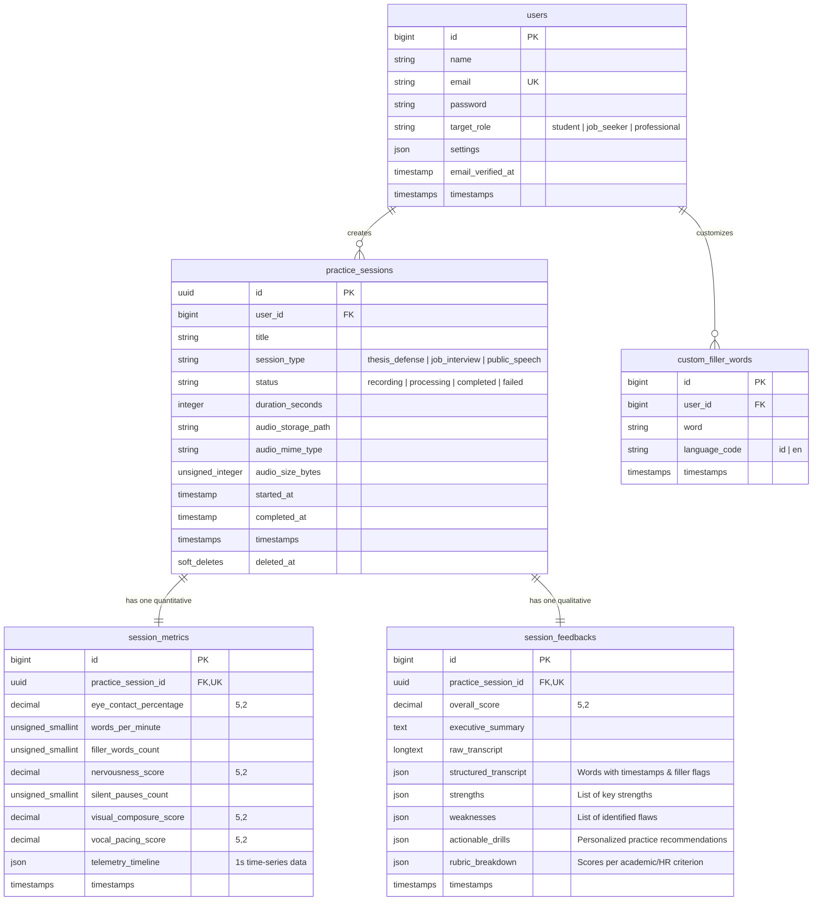

# Database Schema Specification — VOIC
**Laravel 12 Database Migrations, Eloquent Models & Data Contracts**

---

## 1. Entity-Relationship Diagram (ERD)



---

## 2. Detailed Table Specifications & Laravel 12 Migrations

### 2.1 Table: `users`
Menyimpan kredensial pengguna, profil target peran (*target persona*), dan preferensi akun.

```php
Schema::create('users', function (Blueprint $table) {
    $table->id();
    $table->string('name');
    $table->string('email')->unique();
    $table->timestamp('email_verified_at')->nullable();
    $table->string('password');
    $table->string('target_role')->default('student'); // 'student', 'job_seeker', 'professional'
    $table->string('target_institution')->nullable(); // e.g., "Universitas Indonesia", "Google Inc."
    $table->json('settings')->nullable(); // UI sound preferences, camera calibration defaults
    $table->rememberToken();
    $table->timestamps();
});
```

---

### 2.2 Table: `practice_sessions`
Menyimpan rekaman sesi latihan, jenis skenario, status pemrosesan *pipeline*, dan referensi file audio pada penyimpanan aman.

```php
Schema::create('practice_sessions', function (Blueprint $table) {
    $table->uuid('id')->primary();
    $table->foreignId('user_id')->constrained()->cascadeOnDelete();
    $table->string('title');
    $table->enum('session_type', [
        'thesis_defense',    // Simulasi Sidang Skripsi / Tesis
        'job_interview',     // Simulasi Wawancara Kerja (HR/User)
        'public_speech',     // Pidato / Presentasi Bisnis
        'free_practice'      // Latihan Bebas Mandiri
    ])->default('thesis_defense');
    
    $table->enum('status', [
        'recording',         // Sedang berlangsung di browser
        'uploading',         // Sedang mentransfer audio ke backend
        'processing',        // Sedang di antrean Whisper & LLM
        'completed',         // Analisis selesai, siap direview
        'failed'             // Terjadi galat pada pemrosesan
    ])->default('recording');

    $table->unsignedInteger('duration_seconds')->default(0);
    $table->string('audio_storage_path')->nullable();
    $table->string('audio_mime_type')->default('audio/webm');
    $table->unsignedBigInteger('audio_size_bytes')->nullable();
    $table->text('error_message')->nullable();

    $table->timestamp('started_at')->nullable();
    $table->timestamp('completed_at')->nullable();
    $table->timestamps();
    $table->softDeletes();

    $table->index(['user_id', 'created_at']);
    $table->index(['status']);
});
```

---

### 2.3 Table: `session_metrics`
Menyimpan metrik matematis kuantitatif yang dihasilkan secara hybrid: komputasi *on-device* MediaPipe (kontak mata, postur) dan analisis vokal algoritmik Laravel (WPM, *filler words*).

```php
Schema::create('session_metrics', function (Blueprint $table) {
    $table->id();
    $table->foreignUuid('practice_session_id')
          ->constrained('practice_sessions')
          ->cascadeOnDelete()
          ->unique(); // Hubungan 1-to-1 yang ketat

    // Metrik Kontak Mata & Visual (MediaPipe On-Device)
    $table->decimal('eye_contact_percentage', 5, 2)->default(0.00); // 0.00 - 100.00%
    $table->decimal('visual_composure_score', 5, 2)->default(0.00); // Kestabilan kepala & ketenangan (0-100)

    // Metrik Suara & Ritme Bicara (Whisper + Algorithmic Analyzer)
    $table->unsignedSmallInteger('words_per_minute')->default(0); // Optimal: 120-150 WPM
    $table->unsignedSmallInteger('filler_words_count')->default(0); // Total kata jeda (anu, um, dsb.)
    $table->unsignedSmallInteger('silent_pauses_count')->default(0); // Jeda mati > 3 detik
    $table->decimal('vocal_pacing_score', 5, 2)->default(0.00); // Keteraturan tempo bicara (0-100)

    // Indeks Komposit
    $table->decimal('nervousness_score', 5, 2)->default(0.00); // 0 (Tenang) - 100 (Sangat Gugup)

    // Time-Series Telemetri Terperinci (untuk Chart Interaktif di Dasbor)
    // Berisi array snapshot per detik: gaze_detected, head_pitch, head_yaw, wpm_instant
    $table->json('telemetry_timeline')->nullable();

    $table->timestamps();
});
```

---

### 2.4 Table: `session_feedbacks`
Menyimpan hasil evaluasi kualitatif mendalam yang dihasilkan oleh LLM (Gemini 1.5 Flash / Claude 3.5 Sonnet) beserta transkripsi kata-per-kata ber-timestamp dari Groq Whisper.

```php
Schema::create('session_feedbacks', function (Blueprint $table) {
    $table->id();
    $table->foreignUuid('practice_session_id')
          ->constrained('practice_sessions')
          ->cascadeOnDelete()
          ->unique(); // Hubungan 1-to-1 yang ketat

    $table->decimal('overall_score', 5, 2)->default(0.00); // Nilai Keseluruhan (0.00 - 100.00)
    $table->text('executive_summary'); // Ringkasan evaluasi 2-3 kalimat tajam

    // Transkripsi
    $table->longText('raw_transcript'); // Teks lengkap transkripsi
    $table->json('structured_transcript'); // Objek kata ber-timestamp: [{word: "Saya", start: 0.1, end: 0.4, is_filler: false}]

    // Evaluasi Semantik LLM
    $table->json('strengths'); // Array poin kelebihan: ["Argumen metodologi jelas", "Kontak mata konsisten di 2 menit awal"]
    $table->json('weaknesses'); // Array poin kelemahan: ["Terlalu banyak kata 'anu' saat transisi slide 3", "Bicara melampaui 170 WPM di bagian kesimpulan"]
    $table->json('actionable_drills'); // Latihan konkret: ["Latihan jeda napas 2 detik", "Ganti frasa informal ke frasa akademik"]
    $table->json('rubric_breakdown'); // Skor per aspek: { "articulation": 85, "persuasiveness": 78, "clarity": 90, "professionalism": 88 }

    $table->timestamps();
});
```

---

### 2.5 Table: `custom_filler_words`
Kamus kata pengisi kustom yang dapat diperluas oleh pengguna atau disesuaikan dengan dialek regional (misal: "nganu", "kek", "literally", "which is").

```php
Schema::create('custom_filler_words', function (Blueprint $table) {
    $table->id();
    $table->foreignId('user_id')->nullable()->constrained()->cascadeOnDelete(); // Null jika kata default global
    $table->string('word', 60);
    $table->string('language_code', 5)->default('id'); // 'id' atau 'en'
    $table->boolean('is_regex')->default(false);
    $table->timestamps();

    $table->unique(['user_id', 'word', 'language_code']);
});
```

---

## 3. Eloquent Model Architecture & Casts

### 3.1 `App\Models\PracticeSession`
```php
namespace App\Models;

use Illuminate\Database\Eloquent\Concerns\HasUuids;
use Illuminate\Database\Eloquent\Model;
use Illuminate\Database\Eloquent\SoftDeletes;
use Illuminate\Database\Eloquent\Relations\BelongsTo;
use Illuminate\Database\Eloquent\Relations\HasOne;

class PracticeSession extends Model
{
    use HasUuids, SoftDeletes;

    protected $fillable = [
        'user_id',
        'title',
        'session_type',
        'status',
        'duration_seconds',
        'audio_storage_path',
        'audio_mime_type',
        'audio_size_bytes',
        'error_message',
        'started_at',
        'completed_at',
    ];

    protected $casts = [
        'started_at' => 'datetime',
        'completed_at' => 'datetime',
        'duration_seconds' => 'integer',
        'audio_size_bytes' => 'integer',
    ];

    public function user(): BelongsTo
    {
        return $this->belongsTo(User::class);
    }

    public function metric(): HasOne
    {
        return $this->hasOne(SessionMetric::class);
    }

    public function feedback(): HasOne
    {
        return $this->hasOne(SessionFeedback::class);
    }
}
```

### 3.2 `App\Models\SessionMetric`
```php
namespace App\Models;

use Illuminate\Database\Eloquent\Model;
use Illuminate\Database\Eloquent\Relations\BelongsTo;

class SessionMetric extends Model
{
    protected $fillable = [
        'practice_session_id',
        'eye_contact_percentage',
        'visual_composure_score',
        'words_per_minute',
        'filler_words_count',
        'silent_pauses_count',
        'vocal_pacing_score',
        'nervousness_score',
        'telemetry_timeline',
    ];

    protected $casts = [
        'eye_contact_percentage' => 'float',
        'visual_composure_score' => 'float',
        'words_per_minute' => 'integer',
        'filler_words_count' => 'integer',
        'silent_pauses_count' => 'integer',
        'vocal_pacing_score' => 'float',
        'nervousness_score' => 'float',
        'telemetry_timeline' => 'array',
    ];

    public function session(): BelongsTo
    {
        return $this->belongsTo(PracticeSession::class, 'practice_session_id');
    }
}
```

### 3.3 `App\Models\SessionFeedback`
```php
namespace App\Models;

use Illuminate\Database\Eloquent\Model;
use Illuminate\Database\Eloquent\Relations\BelongsTo;

class SessionFeedback extends Model
{
    protected $fillable = [
        'practice_session_id',
        'overall_score',
        'executive_summary',
        'raw_transcript',
        'structured_transcript',
        'strengths',
        'weaknesses',
        'actionable_drills',
        'rubric_breakdown',
    ];

    protected $casts = [
        'overall_score' => 'float',
        'structured_transcript' => 'array',
        'strengths' => 'array',
        'weaknesses' => 'array',
        'actionable_drills' => 'array',
        'rubric_breakdown' => 'array',
    ];

    public function session(): BelongsTo
    {
        return $this->belongsTo(PracticeSession::class, 'practice_session_id');
    }
}
```

---

## 4. Query Performance & Optimization Directives

1. **UUID Primary Keys:** `practice_sessions.id` menggunakan UUID v4 untuk mencegah enumerasi URL sesi dan memastikan keamanan akses data latihan pengguna.
2. **Compound Indexes:** 
   - `['user_id', 'created_at']` pada tabel `practice_sessions` mempercepat pemuatan riwayat sesi latihan di dasbor utama.
   - `['status']` mempercepat *worker job* memonitor sesi yang tertahan (*stuck sessions*).
3. **Eager Loading Guard:** Saat memuat dasbor sesi latihan, selalu gunakan eager loading:
   ```php
   PracticeSession::with(['metric', 'feedback'])->where('user_id', $userId)->latest()->paginate(10);
   ```
   Hal ini mencegah masalah performa N+1 query.
